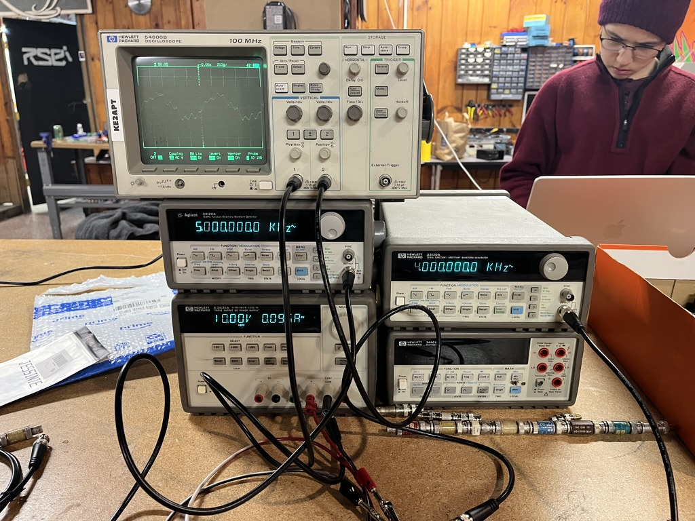
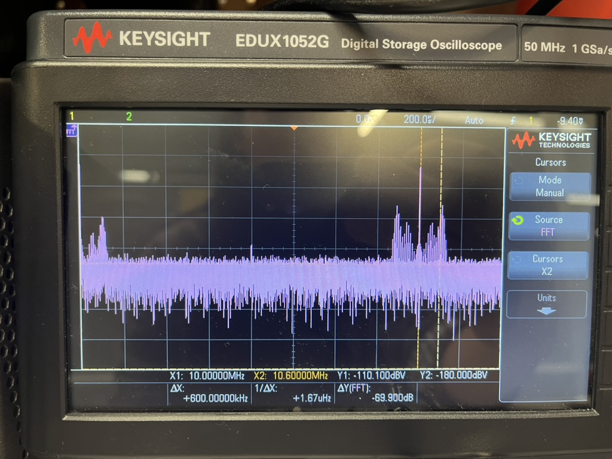

# RF Transmitter Testing Report

**Date:** December 2, 2024
**Test Location:** Electronics Laboratory
**Device Under Test:** RF Mixer/Transmitter Circuit

---

## 1. Executive Summary

This report documents the RF performance testing of a mixer-based transmitter circuit using two-tone intermodulation testing methodology. The circuit successfully demonstrated RF signal generation at 10 MHz with observable mixing products. Testing revealed functional operation with identified areas for optimization in the next development phase.

---

## 2. Test Setup and Equipment

### 2.1 Test Equipment
- **HP 54600B Oscilloscope** (100 MHz bandwidth) - Time domain analysis
- **Keysight EDUX1052G Digital Storage Oscilloscope** (50 MHz, 1 GS/s) - FFT spectrum analysis
- **HP 34401A Digital Multimeter** - DC voltage monitoring
- **Two HP Function Generators** - Dual-tone signal generation
- **HP DC Power Supply** - Mixer bias supply
- **RF Coaxial Attenuators** - Signal conditioning

### 2.2 Test Configuration

**Input Signals:**
- Tone 1 (RF Input): 5.000 kHz with **16 dB attenuation**
- Tone 2 (LO Input): 4.000 kHz with **16 dB attenuation**

**Power Supply:**
- Mixer DC Bias: 10.0 V DC

**Signal Path:**
- Both input tones attenuated by 16 dB each to prevent mixer overdrive
- Output monitored through spectrum analyzer and oscilloscope

### 2.3 Test Methodology

Two-tone intermodulation distortion (IMD) testing was employed to evaluate:
- Mixer linearity
- Spurious product generation
- Spectral purity
- Frequency conversion performance

---

## 3. Test Results

### 3.1 Spectrum Analysis

**Primary Observations:**
- **Output Center Frequency:** ~10 MHz
- **Spectral Components:** Two dominant peaks observed
- **Peak Spacing:** 600 kHz

**Measured Parameters:**
| Parameter | Value |
|-----------|-------|
| Primary Peak (X1) | 10.00000 MHz @ -110.100 dBV |
| Secondary Peak (X2) | 10.60000 MHz @ -180.000 dBV |
| Frequency Separation (ΔX) | 600.000 kHz |
| Amplitude Difference (ΔY) | -69.900 dB |

### 3.2 Signal Characteristics

**Positive Results:**
- Successful RF signal generation at ~10 MHz range
- Clear, identifiable spectral peaks indicating functional mixing operation
- Stable output frequency over measurement period
- Repeatable measurements across multiple test runs

**Observed Characteristics:**
- Broadband noise floor present across spectrum
- Multiple intermodulation products visible
- Primary signal level at -110 dBV (accounting for measurement path attenuation)

---

## 4. Analysis and Discussion

### 4.1 Frequency Conversion Analysis

The circuit demonstrates active frequency upconversion from audio-range input signals (4-5 kHz) to RF output (~10 MHz), indicating:
- Functional mixer operation with local oscillator
- Successful heterodyne frequency translation
- Presence of 10 MHz LO signal (likely from onboard oscillator)

### 4.2 Intermodulation Product Analysis

**Expected Products** (from 4 kHz and 5 kHz inputs):
- 2nd order sum: f1 + f2 = 9 kHz
- 2nd order difference: f1 - f2 = 1 kHz

**Observed Products:**
- 600 kHz spacing between primary spectral components
- This spacing suggests higher-order mixing with the 10 MHz LO
- Potential 3rd or 5th order intermodulation products

**Possible Causes for Intermodulation:**

1. **Mixer Nonlinearity**
   - Mixer operating outside optimal bias point
   - Input signal levels may still be too high despite 16 dB attenuation
   - Nonlinear transfer characteristics generating harmonic content

2. **Impedance Mismatch**
   - Input/output impedance mismatches causing reflections
   - Standing waves creating additional mixing products

3. **Local Oscillator Leakage**
   - LO signal bleeding through to output
   - Insufficient port-to-port isolation in mixer

4. **Power Supply Issues**
   - Inadequate decoupling allowing supply noise injection
   - Ground loop currents coupling into signal path

5. **Insufficient Filtering**
   - Lack of bandpass filtering on output
   - Broadband response allowing spurious emissions

---

## 5. Performance Evaluation

### 5.1 Strengths
- Circuit demonstrates fundamental RF mixing functionality
- Stable frequency generation
- Measurable output power at intended frequency range
- Input attenuation strategy (16 dB) successfully implemented

### 5.2 Areas for Improvement
- Noise floor could be reduced through improved shielding and grounding
- Spectral purity would benefit from output filtering
- Dynamic range optimization through bias point adjustment
- Signal level optimization for better SNR

---

## 6. Recommendations for Next Semester

### 6.1 Circuit Improvements

1. **Filtering Implementation**
   - Add bandpass filter at 10 MHz output to suppress spurious content
   - Implement low-pass filters on 4 kHz and 5 kHz inputs
   - Consider diplexer for LO isolation

2. **Bias Optimization**
   - Characterize mixer performance across bias voltage range (5V - 15V)
   - Determine optimal DC operating point for linearity
   - Add precision voltage regulation for bias stability

3. **Impedance Matching Network**
   - Design and implement 50Ω matching networks
   - Add RF transformers or LC matching circuits
   - Verify with network analyzer measurements

4. **PCB Layout Optimization**
   - Minimize ground loop areas
   - Separate analog and digital ground planes
   - Add RF shielding compartments
   - Improve power supply decoupling with multiple capacitor values

### 6.2 Additional Testing

1. **Swept Frequency Analysis**
   - Test mixer response from 1 kHz to 100 kHz input range
   - Map conversion gain vs. frequency
   - Identify spurious-free dynamic range (SFDR)

2. **Power Measurements**
   - Measure actual output power into 50Ω load
   - Calculate conversion loss/gain
   - Determine 1 dB compression point (P1dB)

3. **Harmonic Analysis**
   - Single-tone testing for harmonic content
   - Third-order intercept point (IP3) measurement
   - Adjacent channel power ratio (ACPR)

4. **Modulation Testing**
   - Apply amplitude modulation to verify signal integrity
   - Test with actual data patterns
   - Measure error vector magnitude (EVM)

### 6.3 Documentation and Characterization

1. Create detailed mixer datasheet with measured parameters
2. Document relationship between attenuation levels and output purity
3. Develop calibration procedures for repeatable measurements
4. Compare performance against simulation predictions

---

## 7. Conclusion

The RF mixer/transmitter circuit successfully demonstrates core functionality with frequency upconversion from audio-range signals (4-5 kHz) to RF output (~10 MHz). The implementation of 16 dB attenuation on both RF and LO inputs shows good engineering practice for input signal conditioning.

While intermodulation products and noise floor indicate room for optimization, the circuit achieves its primary objective of RF signal generation. The observed characteristics are typical of first-generation RF hardware and provide a solid foundation for iterative improvement.

The test results validate the basic design concept and identify clear paths forward for enhanced performance. With the recommended improvements in filtering, impedance matching, and bias optimization, the next iteration should achieve significantly improved spectral purity and reduced intermodulation distortion.

**Overall Assessment:** The circuit demonstrates successful proof-of-concept operation with identifiable optimization opportunities for continued development.

---

## Appendix A: Test Images

### A.1 Laboratory Setup

*Figure 1: Complete test setup showing oscilloscope, function generators, power supply, and measurement instruments.*

### A.2 Spectrum Analysis

*Figure 2: Keysight oscilloscope FFT display showing spectral content at 10 MHz with 600 kHz spacing between primary components.*

---

**End of Report**
