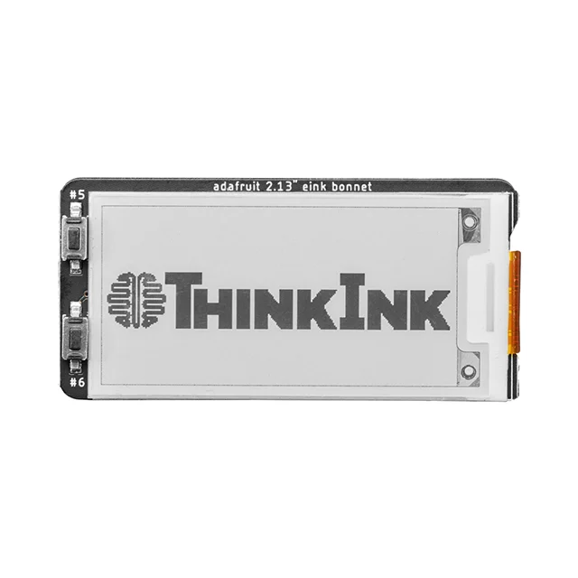
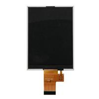
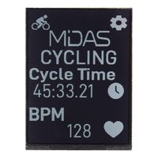
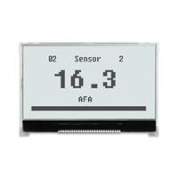
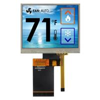
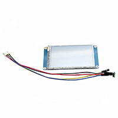
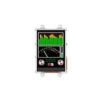
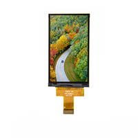
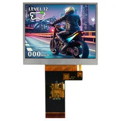
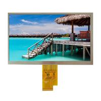

<h1>Displays</h1>
<h2>Selectrion Criteria</h2>

* What size and resolution display do we want  
    * Under 6” but above 3”
    * Enough resolution to ake out details in images, above 128x64
* What interface do we want it to have  
    * Good info here: https://tailorpixels.com/6-most-common-types-of-display-interfaces/  
    * MCU is entirely what this whole thing is, a display powered by a microcontroller  
    * SPI, slow transmission (in the low Mbps) of SPI will make the screen look laggy and it can only handle low res  
    * TTL-RGB looks promising, used in small to medium displays and is fast  
    * MIPI-DSI looks the best and most widely used, however takes a lot of overhead
    * EDP will have way too much overhead and will be too much for the STM32

We will be considering SPI, TTL-RGB, and MIPI-DSI for possible display interface types.

<h2>Display Decision Tables</h2>
<h3>SPI</h3>

| Link     | Size    | Resolution|Type|Mode|Cost|Notes|Photos|
| -------- | ------- |-------    |--- | ---|----|-----|------|
|[4687](https://www.digikey.com/en/products/detail/adafruit-industries-llc/4687/13157992)|2.13”    |250x122    |E-Ink|Reflective|$19.95|E-Ink may be disrupted by RF||
|[GLT035240320WH1](https://www.digikey.com/en/products/detail/globaltech-display/GLT035240320WH1/15978025)|3.5"|240x320|TFT-Color|Transmissive|$28.60|||
|[MDTR0420A-SPI](https://www.digikey.com/en/products/detail/midas-displays/MDTR0420A-SPI/25588718)|4.2"|300x400|TFT-Color|Reflective|$38.65|Only displays white||
<h3>TTL-RGB</h3>

| Link     | Size    | Resolution|Type|Mode|Cost|Notes|Photos|
| -------- | ------- |-------    |--- | ---|----|-----|------|
|[NHD-C12864LZ-FSW-FBW-3V3](https://www.digikey.com/en/products/detail/newhaven-display-intl/NHD-C12864LZ-FSW-FBW-3V3/2625201)      |3.17”    |128x64    |FSTN|Transflective|$17.64|Black & White||
|[NHD-3.5-320240JF-ASXP-T](https://www.digikey.com/en/products/detail/newhaven-display-intl/NHD-3-5-320240JF-ASXP-T/16677483)|3.5”    |320x240 |TFT-Color|Transmissive|$42.42|Touchscreen (Resistive)||
|[104990604](https://www.digikey.com/en/products/detail/seeed-technology-co-ltd/104990604/11201122)|3.5"|480x320|TFT-Color|-|$66.25|Touchscreen (Resistive). 1 in stock at DigiKey.||
|[ULCD-32PTU](https://www.digikey.com/en/products/detail/4d-systems-pty-ltd/ULCD-32PTU/5725480)|3.2"|240x320|TFT-Color|Transmissive|$84.95|Touchscreen (Resistive)|
<h3>MIPI-DSI</h3>

| Link     | Size    | Resolution|Type|Mode|Cost|Notes|Photos|
| -------- | ------- |-------    |--- | ---|----|-----|------|
|[E30RB-I-MW340-N](https://www.digikey.com/en/products/detail/focus-lcds/E30RB-I-MW340-N/13683633)|3”    |360x640|TFT-Color|Transmissive|$34.45|||
|[NHD-3.5-640480EF-MSXP](https://www.digikey.com/en/products/detail/newhaven-display-intl/NHD-3-5-640480EF-MSXP/21705255)|3.5"|640x480|TFT-Color, IPS|Transmissive|$36.62|||
|[ATM0700M61K](https://www.digikey.com/en/products/detail/az-displays/ATM0700M61K/18796392)|7"|1024x600|TFT-Color, IPS|Transmissive|$71.66|Beyond criteria, although will include as cheaper than expected for size||