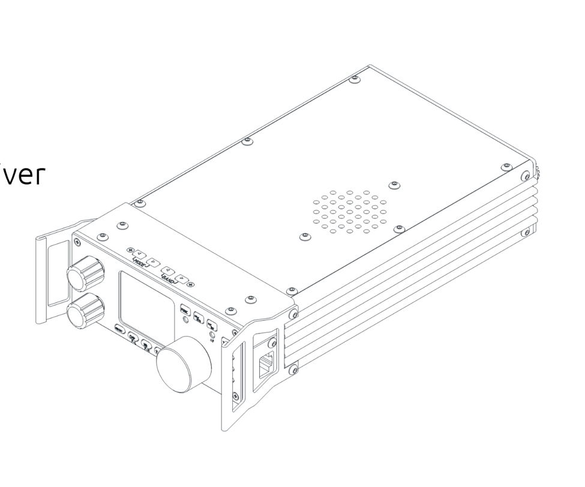
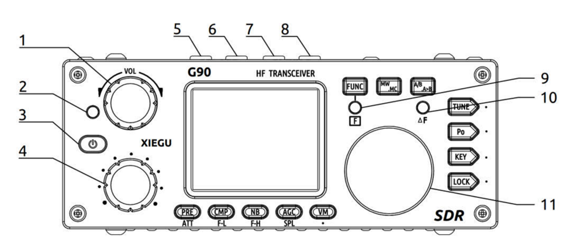
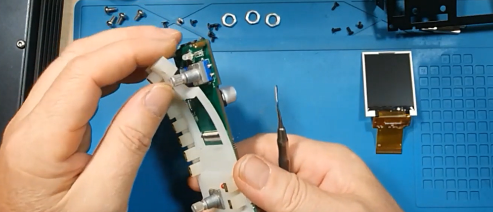
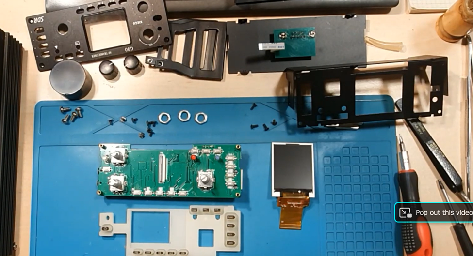
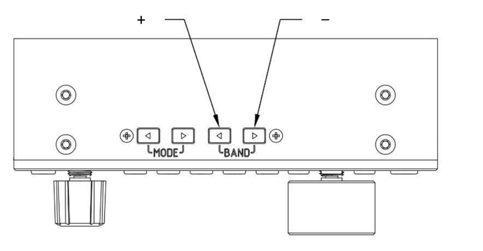
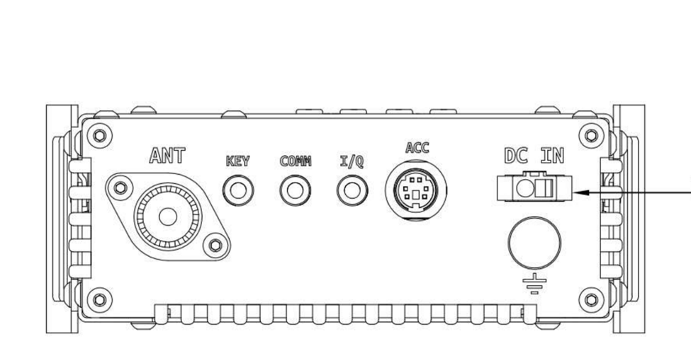
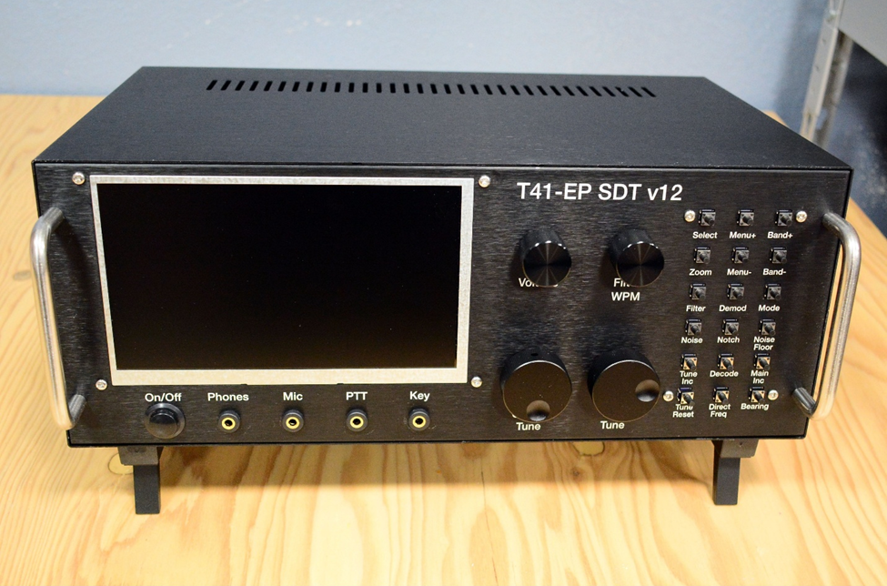
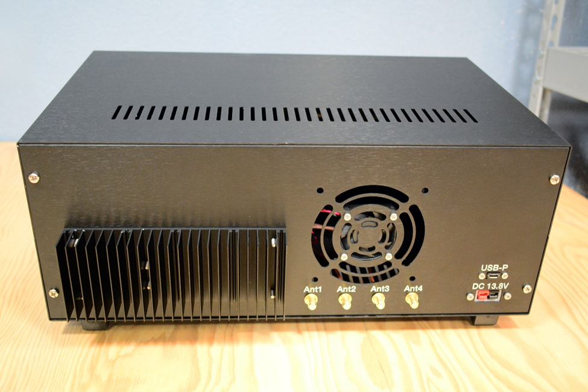
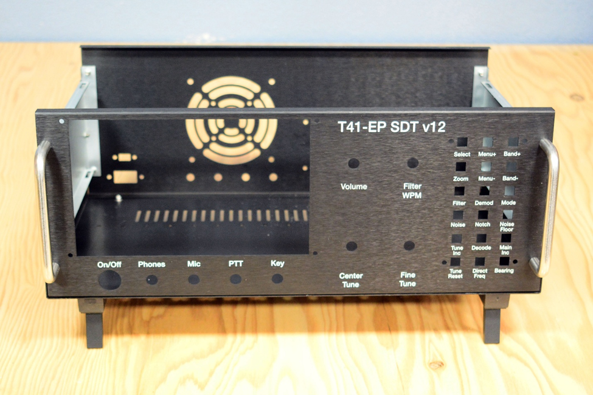

## Materials
Housing will be heavily based on design of the Xiegu G90 HF transceiver

- Considerations
    - Want it to look clean, cleaner than 3d print PLA
    - Should be shock and vibration resisatnt
	- Durable material, EMI shielding
	- Sealed from dust and dirt, possibly water?
	- Formal criteria
        - Cleanliness
        - Shock absorbance
        - Durability
        - EMI shielding
        - Ease of use
	- Rough dimensions
        - 
	- Carbon Fiber filament
        - Pros
            - Strong along xy axis
        - Cons
            - Expensive-ish (doesn’t matter for project apparently) 
            - Very weak along z axis because of 3d printing
        - Rating
            - 3-2-1-1-5
	- CNC Aluminum Alloys
	    - 7075 – aerospace, military, tooling
        	- High strength and weight
	        - Less corrosion resistance than 6061, lower machinability rate
	    - 2024 – aerospace
        	- High strength to weight ratio
	        - High strength and fatigue resistance, significant stress resistance
    	- 5052 – applicable in marine environment, moderate strength
	        - Formable but not as strong as 6061 and 7075
        	- Used in marine environments, construction
        	- Relatively straightforward to machine, but rough surface finishes without the right lubrication
        	- Good for corrosion resistant products
    	- 6082 – high strength, good resistance to corrosion, good machining
        	- Between 6061 and 7075 in strength
        	- Good surface finishing
        	- Good for high volume manufacturing and tight tolerances
        	- Also probably cheap
        	- Pros
            	- Strong
            	- Relatively cheap
            	- Cleaner look most of the time
        	- Cons
            	- Machining is a little more restrictive than 3d printing
            - Overall, leaning towards 6061 aluminum due to popularity although this may be impacted by what RPI has available, as that is likely what will be used
Design
- Heatsink on the bottom and sides
- Top is usually flat for the speaker vent
    - Also means top is probably the best way to get into the radio, so design the top to be unscrewed
- Rest of housing is usually at least a U shaped trough for parts to go in, with the front and back panels being removable
    - Removable top is where most of the maintenance should be done however
- Screws should hold the whole thing together so you can take it apart
	

 
Research
Machining of aluminum alloys: a review
DOI 10.1007/s00170-016-8431-9
-	Aluminum combines lightness and strength making it very useful in manufacturing
-	High strength and ductility, low melting temperature
-	Often used in automotive industry
-	6061 is a typical alloy of magnesium and silicon that is age hardening and can be strengthened considerably through heat treatment
-	2xxx, 6xxx, 7xxx stand out in heat treatability, 1xxx 3xxx 4xxx and 5xxx are mechanically workable
-	Adding oxides, carbides, and nitrides can help strengthen aluminum alloys in many regards
-	Designations as to how alloys are treated, numbers after letter indicate specific treatments under the category

| Symbol | Treatment |
| ------ | ----- |
| F | Fabricated |
| O	| Annealed |
| H	| Strain hardened |
| W	| Solutionized |
| T	| Thermally treated|

-	When ductile materials are machined, large chip tool contact area and high chip thickness ratio leads to better machining power, higher heat generation, and long stringy chips and poor surface finishing
-	But also has low shear strength, making machining easy
-	Any treatment or addition of chemical elements lowers machining forces, compensating the increase in mechanical strength and reduced contact area
-	
 
Electromagnetic interference (EMI) shielding effectiveness (SE) of pure aluminum: an experimental assessment for 5G (SUB 6GHZ)
-	Focus on 5G, which is less than 6 GHz
    - So maybe technically counts for 28-30 MHz
    - Says that it’s particularly effective from 4.5-5.1 GHz so maybe not
 
Electromagnetic shielding and mechanical properties of AL6061 metal matrix composite at X‑band for oblique incidence
-	Metals are usually great at EMI shielding
-	Composite aluminum oxide silicon carbide and AL6061 material has great mechanical properties and shielding of up to 93.48 dB 
-	AL6061 (80%) + Al 2O3(7.5%) + SiC (7.5%) + FA (5%) is best combination for what we want – highest hardness, only a small difference in tensile strength from the highest tensile strength, and less dense that straight AL6061
    - But this is a combination of an alloy and a specific ratio of ingredients, we should stick to stock AL6061, there are enough options to choose from already

AL6061 Properties
-	Thermal conductivity coefficient: 155 W/m*k
-	Ultimate tensile strength: 115-310 depending on specific alloy and temper
-	Yield strength: 50-275 depending on specific alloy and temper
    - Ultimate tensile strength is the amount of stress a material can withstand before breaking period
    - Yield strength is the point at which a material stops deforming elastically and begins to deform plastically, so the point of no return after which it deforms permanently

## Housing Design – Exterior
### G90

- Looks like the front comes off easily
- interface can be taken off as well
- After that, top comes off
- Back can be taken off independently
- Screws hold EVERYTHING together

- Only buttons on the front
- Knobs are fitted onto screws

- Nuts hold knob screws in
- So many screws everywhere
- Front interface of G90 connected to the rest by RS232 cable!

- Silicone pads that the circuit board rests on

- Fully disassembled front interface thing
- Most of the panels look like fabricated sheet metal

- Buttons on top as well, not many though since user will not always be looking at them so they should remember what they do
- Also simple functoins - easier to remember

- Heat sinks on sides and bottom, but the heatsink on the bottom isn't what it sits on, it has separate feet
- Exterior heat sinks are short and thick, probably just dissipate heat a little faster once it gets to that point
- All ports on the back, no buttons
---
### T41-EP SDT

- Handles on the front, like the g90, maybe a common design feature?
    - To protect front panel from smashes
    - RUGGEDNESS
- Bigger overall radio, bigger display
- Volume is separate from on off switch
- Whole arsenal of pushbuttons on the right for different things, bigger knobs more towards middle for ease of access
- Ports for things that come out the front on front

- Heatsink attached to the housing, would not work for 3d printed model would have to go directly on component
    - But can just print with hole for heatsink instead, 3d printing more flexible so should work
- Grate for fan on the back, probably not a bad idea to have a fan
- Power pole port directly inside box
- 4 antenna ports
- Other than all that relatively simplistic back side

- Looks like sides come out, this design has the U shape but front back instead of left to right
- But still a U shaped piece
    - And the front and back come off too, so it’s really just 6 fancy sheets screwed together
    - Might be easier to just do sheet metal bending if that’s all we need
- Sheet metal fabrication is a possibility  with this one
    - The bars could just be made with rods bent in the right shapes
    - Bottom standoffs might be CNC or something but the rest is just sheet metal, very cheap, don’t know about strength