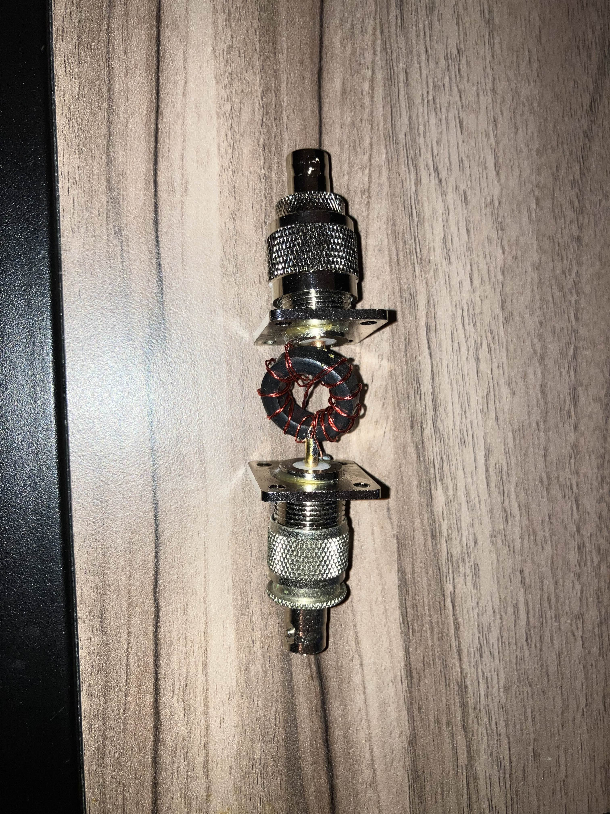
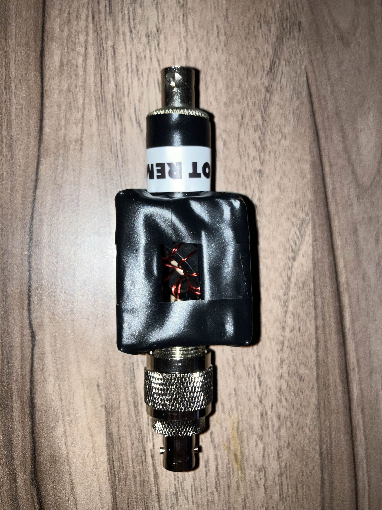
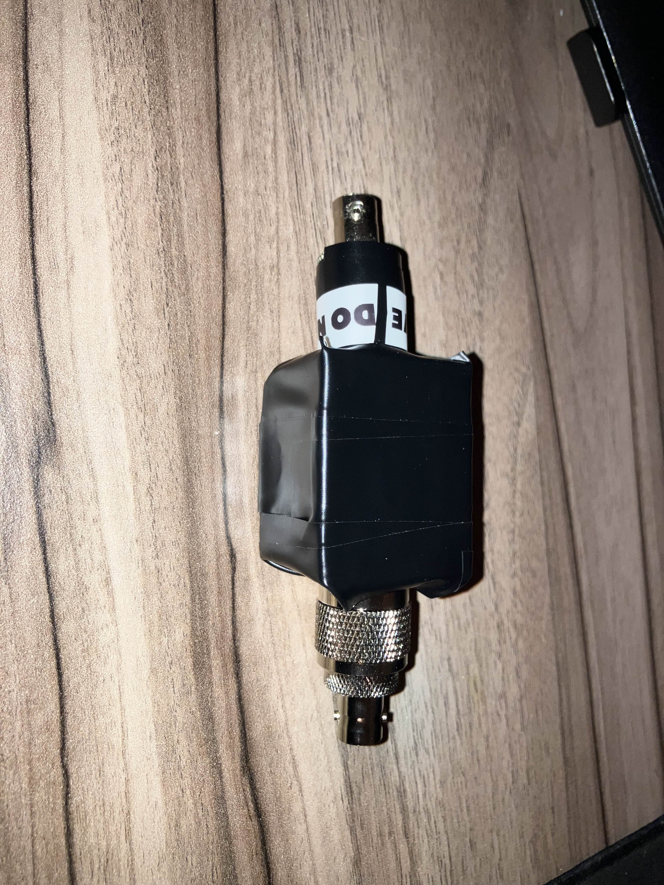

While creating the balun, I created some notes for future people that want to create a balun. 

In some connectors, specifically in one of the connectors used to create the balun, the dielectric inside of the connector might spin. While this might seem inconsequential, once I fully finished putting together the balun, when I was screwing on an adapter to change the connector to BNC female, the dielectric inside spun while screwing the connector on and resulted in the connected enameled copper wire to the main pin of the connector breaking off. I had to solder on an extra 26 gauge piece of wire to the balun and the connector in order to securely connect it back again.
Thus, when creating a balun, make sure your connectors are of good quality and have no defects, especially if the dielectric spins. This could have been much worse, as I could've fully finished the enclosure, put the adapter on, and thought everything was completely fine until I continuity tested it, and realized it broke off. 

When creating the balun, I chopped off a little too much wire than I was supposed to. Thus, it is a very close fit and tere is very little to no stress relief if both connectors are tugged in opposite directions. This is not ideal, especially since the solder to the ground side of the connector isn't the most stable. Thus, always remember to keep extra wire so there is strain relief. In this case, extra wire won't hurt the balun at all, since the wire is coated. If anything, you could even fold the wire to make a manifold that expands when the connector is pulled.

For this balun, I used 5 turns on one side, and 5 turns on the other to keep the 1:1 match. I also wound the wires together using a drill and pliers, so that they stay together and is much easier to run rather than two separate wires around the balun.

Below are some pictures of the finished product, in order of progression of enclosed the casing is.

